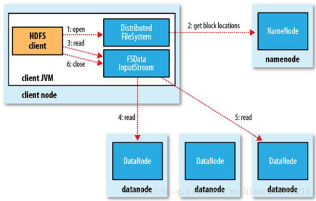
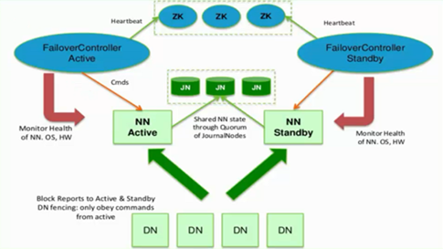

 <h1>HDFS学习笔记</h1>

###1.HDFS简介
1. **HDFS**（Hadoop Distributed File System)是Hadoop项目的核心子项目，是分布式计算中数据存储管理的基础，是基于**流式数据模式**访问和处理超大文件的需求而开发的。
2. **HDFS数据块**：HDFS上的文件被划分为块大小的多个分块，作为独立的存储单元，称为数据块，hadoop1.x默认大小是64MB,1.x默认大小是128MB。 
	使用数据块的好处：
	 - 一个文件的大小可以大于网络中任意一个磁盘的容量。文件的所有块不需要存储在同一个磁盘上。因此文件可以利用集群中的任意磁盘进行存储
	 - 简化了存储子系统的设计，将存储子系统控制单元设置为块，可简化存储管理，同时元数据就不需要和块一同存储，用一个单独的系统管理这些块的元数据。
	 - 数据块适合用于数据备份进而提供数据容错能力和提高可用性。
	 - 查看快信息：hadoop dfs /-files -blocks
3. HDFS的三个节点：Namenode，Datanode，Secondary Namenode
	 - **Namenode**：HDFS的守护进程，用来管理文件系统的命名空间，负责记录文件是如何分割成数据块，以及这些数据块分别被存储到那些数据节点上，它的主要功能是对内存及IO进行集中管理。
	 - **Datanode**：文件系统的工作节点，根据需要存储和检索数据块，并且定期向namenode发送他们所存储的块的列表。
	 - **Secondary Namenode**：辅助后台程序，与NameNode进行通信，以便定期保存HDFS元数据的快照。
###2.HDFS的劣势，不适合的场合
1. 低延时数据访问
	 - 比如毫秒级的来存储数据，这是不行的，它做不到。
	 - 它适合高吞吐率的场景，就是在某一时间内写入大量的数据。但是它在低延时的情况下是不行的，比如毫秒级以内读取数据，这样它是很难做到的。
2. 小文件存储
	 - 存储大量小文件(这里的小文件是指小于HDFS系统的Block大小的文件（默认128M）)的话，它会占用 NameNode大量的内存来存储文件、目录和块信息。这样是不可取的，因为NameNode的内存总是有限的。
	 - 小文件存储的寻道时间会超过读取时间，它违反了HDFS的设计目标。
3. 并发写入、文件随机修改
	 - 一个文件只能有一个写，不允许多个线程同时写。
	 - 仅支持数据 append（追加），不支持文件的随机修改。
###3.HDFS存储数据
  

HDFS的架构图

HDFS 采用Master/Slave的架构来存储数据，这种架构主要由四个部分组成，分别为HDFS Client、NameNode、DataNode和Secondary NameNode。下面我们分别介绍这四个组成部分: 

1. Client客户端
	- 文件切分。文件上传HDFS的时候，Client会将文件切分成一个个的block块，进行存储
	- 与NameNode交互，获取文件的存储信息。
	- 与DataNode交互，读取或写入文件。
	- Client提供一些命令来管理HDFS，比如启动、关闭命令。
	- Client可以通过一些命令来访问HDFS，比如put、pull。	
2. NameNode：就是master，是一个管理者
	 - 管理HDFS的名称空间
	 - 管理数据块(block)映射信息
	 - 配置副本策略
	 - 处理客户端读写请求
3. DataNode：就是slave，NameNode下达命令，DataNode执行实际读写操作
	 - 存储实际的数据块
	 - 执行数据块的读写操作
4. Secondary NameNode：并非 NameNode 的热备。当NameNode 挂掉的时候，它并不能马上替换 NameNode 并提供服务。
	 - 负责NameNode分担其工作量
	 - 定期合并 fsimage和fsedits，并推送给NameNode。
	 - 在紧急情况下，可辅助恢复 NameNode。
	 - 默认安装在namenode节点上，但。。。。不安全
5. 详细介绍一下NameNode和Secondary NameNode的工作原理 
	NameNode又成为名称节点，是负责管理分布式文件系统的命名空间，（Namespace），保存了两个核心的数据结构，即FsImage和EditLog。 可以理解为大管家，不负责存储具体的数据
	 - FsImage用于维护文件系统树以及文件树中所有的文件和文件夹的元数据元数据的存储格式
	 - 操作日志文件EditLog中记录了所有针对文件的创建、删除、重命名等操作。
	 - 注意：这两个都是文件，也会加载解析到内存中
	 
	为啥会拆成两个？主要是FsImage文件很大，把增量的修改放到EditLog中，一个FsImage和一个Editlog进行合并会得到一个新的FsImage。

	因为NameNode是大管家，所以如果坏了丢失了，就相当于系统引导区坏了，那整个文件系统就崩溃了。所以NameNode存储的元数据很重要，就需要备份。这个时候就产生了一个叫sendaryNamenode的节点用来做备份，它会定期的和namenode就行通信来完成整个的备份操作。具体的操作如下: 

	     
		  
	SecondaryNameNode的工作情况：
	 - SecondaryNameNode会定期和NameNode进行通信，请求其停止使用EditLog文件，暂时将新的写操作日志写入到新文件edit.new中。这个操作是瞬间完成，上层写日志的函数完全感觉不到差别
	 - SecondaryNameNode通过HTTP GET方式从NameNode获取FsImage和EditLog，并下载到本地相应目录下。
	 - SecondaryNameNode将下载下来的FsImage加载到内存中，然后一条一条的执行EditLog中的更新操作，使得内存中的FsImage保持最新。这个过程就是EditLog和FsImage文件合并。
	 - SecondaryNameNode执行完合并操作后，就会通过HTTP POST方法将合并后的FsImage发送到NameNode节点上
	 - NameNode将从SecondaryNameNode接收到的新的FsImage替换旧的FsImage文件，同时将edit.new替换EditLog文件，通过这个过程EditLog就变小了 
	 除了这个自带的备份操作，还需要进行人工的备份，把一份fsimage到多个地方进行备份，万一namenode的节点坏了呢。

6. NameNode中元数据 
namenode对元数据有三种存储方式： 
	 * 内存元数据(NameSystem)：就是当前namenode正在使用的元数据，是存储在内存中的。
	 * 磁盘元数据镜像文件（fsimage)：是内存元数据的镜像，保存在namenode工作目录中，它是一个准元数据，作用是在namenode宕机时能够快速较准确的恢复元数据。称为fsimage。
	 * 数据操作日志文件(EditLog)：是用来记录元数据操作的，在每次改动元数据时都会追加日志记录，如果有完整的日志就可以还原完整的元数据。主要作用是用来完善fsimage，减少fsimage和内存元数据的差距。称为editslog。 

	NameNode中元数据的存储细节 
NameNode(Filename,replicas,block-ids,ids2host...) 
例子：/test/a.log, 3, {blk_1,blk_2}, [{blk_1:[h0,h1,h3]},{blk_2:[h0,h2,h4]}] 
如何知道数据块是否损坏：校验和CRC32，每一个块有一个校验和。 
7. 什么时候checkpoint（即合并edits文件）  
由hdfs-site.xml配置文件中的配置决定： 
fs.checkpoint.period指定两次checkpoint的最大时间间隔，默认3600s  
fs.checkpoint.size 规定edits文件的最大值，一旦超过这个值则强制checkpoint，不管是否达到最大时间间隔。默认大小是64M.  

###4.HDFS读取数据
  
HDFS文件读取原理，分以下几个步骤： 

1. 通过调用FileSystem的open()方法，获取一个DistributedFileSystem的实例
2. DistributedFileSystem通过RPC访问NameNode，获取文件第一批blocks的location，同一个block会按照副本数返回多个locations，这些locations会按照hadoop的拓扑结构排序，距离客户端近的排在前面。
3. 前两步会返回一个FSDataInputStream对象，该对象会被封装成 DFSInputStream对象，DFSInputStream可以方便的管理DataNode和DataNode的数据流。 客户端调用Read方法，DFSInputStream就会找出离客户端最近的datanode并连接。
4. 数据从datanode流向客户端
5. 如果第一个block块的数据读取完了，就会关闭第一个block的dataNode连接，接着读取下一个块。这些操作对客户端来说是透明的，从客户端的角度来看只是读一个持续不断的流。
6. 如果第一批block都读完了，DFSInputStream就会去namenode拿下一批blocks的location，然后继续读，如果所有的block块都读完，这时就会关闭掉所有的流。

###5.HDFS写入文件
写入文件时，是先存储文件，然后再告知namenode各个块的映射地址，还是先安排好地址再存入的数据的。 
block块映射是以什么样的格式存储在Namenode中的 
  
HDFS写入文件原理，分以下几个步骤： 

1. Client通过调用**DistributedFileSystem**的create()方法，创建一个新的文件
2. DistributedFileSystem通过**RPC**访问NameNode，去创建一个没有blocks关联的新文件。创建前NameNode会做各种校验，比如文件是否存在，客户端有无权限去创建等。如果校验通过，NameNode 就会记录下新文件，否则就会抛出IO异常。
3. 前两步结束就会返回**FSDataOutputStream**对象，和读文件的时候相似，FSDataOutputStream 被封装成 **DFSOutputStream**，DFSOutputStream 可以协调 NameNode和 DataNode。客户端开始写数据到DFSOutputStream,DFSOutputStream会把数据切成一个个小 **packet**，然后排成队列 data queue。
4. **DataStreamer** 会去处理接受 data queue，它先问询 NameNode 这个新的 block 最适合存储的在哪几个DataNode里，比如重复数是3，那么就找到3个最适合的 DataNode，把它们排成一个 **pipeline** 。DataStreamer 把 packet 按队列输出到管道的第一个 DataNode 中，第一个 DataNode又把 packet 输出到第二个 DataNode 中，以此类推。
5. DFSOutputStream 还有一个队列叫 ack queue，也是由 packet 组成，等待DataNode的收到响应，当pipeline中的所有DataNode都表示已经收到的时候，这时akc queue才会把对应的packet包移除掉。
6. 客户端完成写数据后，调用close方法关闭写入流。
7. DataStreamer 把剩余的包都刷到 pipeline 里，然后等待 ack 信息，收到最后一个 ack 后，通知 DataNode 把文件标示为已完成。

###6.HDFS删除数据分析
Hdfs删除数据流程：

* 客户端向namenode发起RPC调用，请求删除文件。namenode检查合法性。
* namenode查询文件相关元信息，向存储数据块的datanode发送删除请求。
* datanode删除相关数据块。返回结果。
* namenode返回结果给客户端。

**注意**：   当用户或应用程序删除某个文件时，这个文件并没有立刻从HDFS中删除。实际上，HDFS会将这个文件重命名转移到/trash目录。只要文件还在/trash目录中，该文件就可以被迅速地恢复。文件在/trash中保存的时间是可配置的，当超过这个时间时，Namenode就会将该文件从名字空间中删除。删除文件会使得该文件相关的数据块被释放。注意，从用户删除文件到HDFS空闲空间的增加之间会有一定时间的延迟。只要被删除的文件还在/trash目录中，用户就可以恢复这个文件。如果用户想恢复被删除的文件，他/她可以浏览/trash目录找回该文件。/trash目录仅仅保存被删除文件的最后副本。/trash目录与其他的目录没有什么区别，除了一点：在该目录上HDFS会应用一个特殊策略来自动删除文件。目前的默认策略是删除/trash中保留时间超过6小时的文件。将来，这个策略可以通过一个被良好定义的接口配置。

　　当一个文件的副本系数被减小后，Namenode会选择过剩的副本删除。下次心跳检测时会将该信息传递给Datanode。Datanode遂即移除相应的数据块，集群中的空闲空间加大。同样，在调用setReplication API结束和集群中空闲空间增加间会有一定的延迟。

###7.HDFS 副本存放策略
namenode如何选择在哪个datanode 存储副本（replication）？这里需要对可靠性、写入带宽和读取带宽进行权衡。Hadoop对datanode存储副本有自己的副本策略，在其发展过程中一共有两个版本的副本策略，分别如下所示: 
  

###8.hadoop2.x新特性
* 引入了NameNode Fedaration，解决了内存横向扩展
* 引入了NameNode HA，解决了NameNode 单点故障
* 引入了YARN，负责资源管理和调度
* 增加了ResourceManager HA解决了ResourceManager单点故障

以下分别介绍这四个新特性：

1. NameNode Fedaration

	  
	 * 存在多个NameNode，每个NameNode分管一部分目录
	 * NameNode共用DataNode 	
这样做的好处是，当NameNode内存受限时，能扩展内存解决内存受限问题。并且每个NameNode独立工作，其中一个NameNode节点挂掉不影响其他的NameNode提供服务。虽然有多个NameNode分管不同的目录，但是对特定NameNode，依然存在单点故障，因为没有热备。解决单点故障用NameNode HA。

2. NameNode HA

	解决方案：
	 - 基于NFS共享存储解决方案	  
	Active NameNode与Standby NameNode通过NFS实现共享数据，但如果Active NameNode与NFS之间或Standby NameNode与NFS之间，其中一处有网络故障的话，那就会造成数据同步问题
	 - 基于Qurom Journal Manager(QJM)解决方案 
	 
	 	  
	1）Active NN、Standby NN有主备之分，NN Active是主的，NN Standby备用的 
	2）集群启动之后，一个namenode是active状态，来处理client与datanode之间的请求，并把相应的日志文件写到本地中或JN中； 
	3）Active NN与Standby NN之间是通过一组JN共享数据（JN一般为奇数个，ZK一般也为奇数个），Active NN会把日志文件、镜像文件写到JN中去，只要JN中有一半写成功，那就表明Active NN向JN中写成功啦，Standby NN就开始从JN中读取数据，来实现与Active NN数据同步，这种方式支持容错，因为Standby NN在启动的时候，会加载镜像文件（fsimage）并周期性的从JN中获取日志文件来保持与Active NN同步 
	4）为了实现Standby NN在Active NN挂掉之后，能迅速的再提供服务，需要DN不仅需要向Active NN汇报，同时还要向Standby NN汇报，这样就使得Standby NN能保存数据块在DN上的位置信息，因为在NameNode在启动过程中最费时工作，就是处理所有DN上的数据块的信息 
	5）为了实现Active NN高热备，增加了FailoverController和ZK，FailoverController通过Heartbeat的方式与ZK通信，通过ZK来选举，一旦Active NN挂掉，就选取另一个FailoverController作为active状态，然后FailoverController通过rpc，让standby NN转变为Active NN 
	6）FailoverController一方面监控NN的状态信息，一方面还向ZK定时发送心跳，使自己被选举。当自己被选为主（Active）的时候，就会通过rpc使相应NN转变Active状态

3. 结合HDFS2的新特性，在实际生成环境中部署图

	  
这里有12个DN,有4个NN，NN-1与NN-2是主备关系，它们管理/share目录；NN-3与NN-4是主备关系，它们管理/user目录

4. 引入了YARN，负责资源管理和调度
5. 增加了ResourceManager HA解决了ResourceManager单点故障

###9.命令行界面访问HDFS
1. -help [cmd]	//显示命令的帮助信息
2. -ls(r) <path>	//显示当前目录下所有文件
3. -du(s) <path>	//显示目录中所有文件大小
4. -count[-q] <path>	//显示目录中文件数量
5. -mv <src> <dst>	//移动多个文件到目标目录
6. -cp <src> <dst>	//复制多个文件到目标目录
7. -rm(r)		//删除文件(夹)
8. -put <localsrc> <dst>	//本地文件复制到hdfs
9. -copyFromLocal	//同put
10. -moveFromLocal	//从本地文件移动到hdfs
11. -get [-ignoreCrc] <src> <localdst>	//复制文件到本地，可以忽略crc校验
12. -getmerge <src> <localdst>		//将源目录中的所有文件排序合并到一个文件中
13. -cat <src>	//在终端显示文件内容
14. -text <src>	//在终端显示文件内容
15. -copyToLocal [-ignoreCrc] <src> <localdst>	//复制到本地
16. -moveToLocal <src> <localdst>
17. -mkdir <path>	//创建文件夹
18. -touchz <path>	//创建一个空文件

###10.JAVA API访问HDFS
JAVA API操作HDFS的文件系统，首先要获取用于操作文件系统的实例，而文件系统的又是与当前的系统的环境变量息息相关。对于操作HDFS来说，环境配置主要是core-site.xml中的相关配置。

1. 获取文件系统访问实例

		Configuration conf = new Configuration();  //获取当前的默认环境配置
		FileSystem fs = FileSystem.get(conf);   //根据当前环境配置，获取文件系统访问实例
Configuration还提供了用于增加和修改当前环境配置的方法，如addResource(Path file)可以增加xml格式的配置,set(String name,String value)以键值对的形式新增/修改配置项：

		public static FileSystem get(Configuration conf) throws IOException;
		public static FileSystem get(URI uri,Configuration conf) throws IOException;
第一个方法是使用默认的URI地址(core-site.xml中配置)获取当前环境变量来加载文件系统，第二个方法则传入指定的URI路径来获取实例。
2. 向HDFS中写入数据

	向HDFS中写入数据，提供了如下API：

		public FSDataOutputStream create(Path f) throws IOException;
		public FSDataOutputStream append(Path f) throws IOException;
		public void write(byte b[]) throws IOException;
		public final void writeBytes(String s) throws IOException
		public final void writeUTF(String str) throws IOException	

	 - create方法根据路径创建数据流对象，如果path目录的文件已经存在，则会覆盖原文件的内容
	 - append方法则在原路径的文件上追加写入。
	 - 以上两个，都返回了FSDataOutputStream对象，其继承至DataOutputStream，提供了标准I/O的操作。FSDataOutputStream提供了很多写出数据流的方法如重载的write,writeBytes,writeUTF等。
	 - flush提供了一种将缓冲区的数据强制刷新到文件系统的方法。
	 - write()提供了一种带有回调方法的参数，回去在每次写出缓存时，提供进度。

	例如：

		OutputStream out = fs.create(new Path(dst), new Progressable() {
    	public void progress() {
        	System.out.print(".");
    	}
		});
		IOUtils.copyBytes(in, out, 4096, true);
3. 读取HDFS文件系统的数据

		public FSDataInputStream open(Path f) throws IOException;
		public final int read(byte b[], int off, int len) throws IOException;

		public class FSDataInputStream extends DataInputStream implements Seekable, PositionedReadable,
		 ByteBufferReadable, HasFileDescriptor, CanSetDropBehind, CanSetReadahead, HasEnhancedByteBufferAccess, CanUnbuffer ;

	 - open()方法根据传进来的path路径，获取环境变量，并设置读取的缓冲区大小（默认为4096），然后返回FSDataInputStream实例
	 - FSDataInputStream继承至DataInputStream，并实现了Seekable等接口。
	 - DataInputStream继承至标准I/O类，Seekable接口实现对数据的重定位，PositionedReadable接口实现从指定偏移量处读取文件。 
	 - read()方法从指定off位置读取len长度的字节存入byte数组。如果到达文件尾则返回-1，否则返回读取的实际长度。
4. 文件/目录操作
	
		public boolean mkdirs(Path f);
		//提供递归的创建path目录功能，mkdirs还有带权限的重载版本

		public abstract boolean delete(Path paramPath, boolean paramBoolean) ;
		//如果paramBoolean为false，则不能递归的删除子目录，如果此时目录非空，将抛出异常Directory is not empty

		public abstract FileStatus[] listStatus(Path paramPath);
		//listStatus方法可以列出指定目录下的文件或者文件夹（不能递归列出），具有PathFilter过滤的重载版本

		private void listStatus(ArrayList<FileStatus> results, Path f, PathFilter filter) ;
		//FileStatus对象描述了文件的各种属性，诸如文件是否是文件夹，文件的权限，所有者等，isDirectory(),getLen(),getPath()...

		copyFromLocalFile(src, dst);  //从本地拷贝文件到HDFS
		copyToLocalFile(src, dst);    //从HDFS直接拷贝文件到本地

5. API实例如下：

		public class HDFSDemo {	
		private FileSystem fs = null;
	
		/**
	 	* 获取文件系统访问实例
	 	* @throws IOException
	 	* @throws URISyntaxException
	 	* @throws InterruptedException
	 	*/
		@Before
		public void init() throws IOException, URISyntaxException, InterruptedException{
			//System.setProperty("HADOOP_USER_NAME","root");
			Configuration conf  = new Configuration();  //获取当前的默认环境配置
			fs = FileSystem.get(new URI("hdfs://master:9001"), conf,"root");//根据当前环境配置，获取文件系统访问实例
		}	
	
		/**
	 	* 创建文件目录
	 	* @throws IllegalArgumentException
	 	* @throws IOException
	 	*/
		@Test
		public void testMkdir() throws IllegalArgumentException, IOException{
			boolean flag = fs.mkdirs(new Path("/data/test"));
			System.out.println(flag);
		}
	
		/**
		 * 删除文件或文件夹
		 * @throws IllegalArgumentException
	 	* @throws IOException
	 	*/
		public void testRmdir() throws IllegalArgumentException, IOException{
			boolean flag = fs.delete(new Path("/data/test/test.txt"), true);
			System.out.println(flag);
		}
	
		/**
	 	* 获取目录下所有文件
	 	* @throws FileNotFoundException
	 	* @throws IllegalArgumentException
	 	* @throws IOException
	 	*/
		public void testListAllFile() throws FileNotFoundException, IllegalArgumentException, IOException{		
       	 	FileStatus[] status = fs.listStatus(new Path("/data/test/"));//列出目录内容       
        	Path[] listedPaths = FileUtil.stat2Paths(status); //获取目录下所有文件路径       
        	for (Path path : listedPaths) {//循环读取每个文件
            	System.out.println(path);
        	}
		}
	
		/**
		 * 将文件上传至HDFS
	 	* @throws IllegalArgumentException
	 	* @throws IOException
	 	*/
		public void testCopyFromLocal() throws IllegalArgumentException, IOException{
			fs.copyFromLocalFile(new Path("C:\\学习\\test.txt"), new Path("/data/test/"));
		}
	
		/**
	 	* 从HDFS下载文件
	 	* @throws IllegalArgumentException
	 	* @throws IOException
	 	*/
		public void testCopyToLocal() throws IllegalArgumentException, IOException{
			fs.copyToLocalFile(new Path("/data/test/test.txt"), new Path("C:\\学习\\"));
		}
	
		/**
	 	* 从HDFS下载文件
	 	* @throws IllegalArgumentException
	 	* @throws IOException
	 	*/
		public void testUpload() throws IllegalArgumentException, IOException{
			InputStream in = fs.open(new Path("/data/input/test.txt"));		
			FileOutputStream out = new FileOutputStream(new File("C:\\学习\\"));		
			IOUtils.copyBytes(in, out, 2048, true);
		}
	
		/**
	 	* 获取hdfs集群节点信息
	 	* @throws IOException
	 	*/
		public void getHdfsNodes() throws IOException{
			DistributedFileSystem dfs = (DistributedFileSystem )fs;//获取分布式文件系统
			DatanodeInfo[] dataNodeStats = dfs.getDataNodeStats(); //获取所有节点		
        	for (int i = 0; i < dataNodeStats.length; i++) {
            	System.out.println("DataNote_" + i + "_Name:" + dataNodeStats[i].getHostName());//循环遍历
        	}
		}
	
		/**
	 	* 查找某个文件在HDFS集群的位置
	 	* @throws IllegalArgumentException
	 	* @throws IOException
	 	*/
		public void getFileLocal() throws IllegalArgumentException, IOException{
			//获取文件目录
        	FileStatus fileStatus = fs.getFileStatus(new Path("/data/input/test.txt"));
        	//获取文件块位置列表
        	BlockLocation[] blockLocations = fs.getFileBlockLocations(fileStatus, 0, fileStatus.getLen());
        	//循环输出块信息
        	for (int i = 0; i < blockLocations.length; i++) {
            	String[] hosts = blockLocations[i].getHosts();
            	System.out.println("block_" + i + "_location:" + hosts[0]);
        	}
		}
	
		/**
		 * hdfs文件写入
	 	* @throws IllegalArgumentException
	 	* @throws IOException
	 	*/
		public void write() throws IllegalArgumentException, IOException{
			FSDataOutputStream fout = fs.create(new Path("/data/input/test.txt"));
			byte[] bWrite = "hello hadoop distribute file system \n".getBytes();
			fout.write(bWrite);//写入字节数组
			fout.flush();//flush提供了一种将缓冲区的数据强制刷新到文件系统的方法
			fout.close();//关闭写出流
		
			fout = fs.append(new Path("/data/input/test.txt"));
			fout.write("append: the append method of java API \n".getBytes());	
			fout.close();
		}
	
		/**
	 	* 从hdfs读取
	 	* @throws IllegalArgumentException
	 	* @throws IOException
	 	*/
		public void read() throws IllegalArgumentException, IOException{
		FSDataInputStream fin = fs.open(new Path("/data/input/test.txt"));
			byte[] buff = new byte[128];
			int len = 0;
			while((len = fin.read(buff,0,128)) != -1){
			 	System.out.print(new String(buff,0,len));
			}
		}
	
		@After
		public void afterAll() throws IOException{
			fs.close();
		}
		}

6. 遇到的问题

	append()遇到的问题

		java.io.IOException: Failed to replace a bad datanode on the existing pipeline due to no more good datanodes being available to try. (Nodes: current=[192.168.232.9:50010, 192.168.232.10:50010], original=[192.168.232.9:50010, 192.168.232.10:50010]). The current failed datanode replacement policy is DEFAULT, and a client may configure this via 'dfs.client.block.write.replace-datanode-on-failure.policy' in its configuration.
		at org.apache.hadoop.hdfs.DFSOutputStream$DataStreamer.findNewDatanode(DFSOutputStream.java:960)
		at org.apache.hadoop.hdfs.DFSOutputStream$DataStreamer.addDatanode2ExistingPipeline(DFSOutputStream.java:1026)
		at org.apache.hadoop.hdfs.DFSOutputStream$DataStreamer.setupPipelineForAppendOrRecovery(DFSOutputStream.java:1175)
		at org.apache.hadoop.hdfs.DFSOutputStream$DataStreamer.run(DFSOutputStream.java:531)
解决方法：

		Configuration conf  = new Configuration();  //获取当前的默认环境配置
		conf.set("dfs.client.block.write.replace-datanode-on-failure.policy", "NEVER"); 
		conf.set("dfs.client.block.write.replace-datanode-on-failure.enable","true" ); 
原因：
	 - dfs.client.block.write.replace-datanode-on-failure.enable=true  
	在进行pipeline写数据（上传数据的方式）时，如果DN或者磁盘故障，客户端将尝试移除失败的DN，然后写到剩下的磁盘。一个结果是，pipeline中的DN减少了。这个特性是添加新的DN到pipeline。这是一个站点范围的选项。当集群规模非常小时，例如3个或者更小，集群管理者可能想要禁止掉此特性。  
	 - dfs.client.block.write.replace-datanode-on-failure.policy=DEFAULT  
	此属性仅在dfs.client.block.write.replace-datanode-on-failure.enable设置为true时有效。  
      ALWAYS: 总是添加新的DN  
      NEVER: 从不添加新的DN  
      DEFAULT: 设r是副本数，n是要写的DN数。在r>=3并且floor(r/2)>=n或者r>n(前提是文件是hflushed/appended)时添加新的DN。  

###11.Remote Procedure Call
RPC--不同进程间的方法调用，底层走的还是socket，RMI底层也是socket。 
Webservice---不同语言不同平台间方法调用的解决方案。 
	  

Client 与 namenode 、 namenode与 datanode、 Client 与 datanode之间的通信都是用的RPC。
